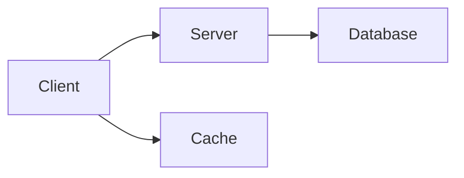

# Convert ASCII Agent

Convert ASCII diagrams to Draw.io or other image formats.

## Purpose

Take an ASCII diagram and generate a proper diagram file (Draw.io XML, Mermaid, etc.).

## Prerequisites

- ASCII diagram content (from detect-ascii or direct input)
- Target format specified

## Inputs

| Input | Required | Description |
|-------|----------|-------------|
| ASCII content | Yes | The ASCII diagram text |
| Output format | No | draw.io (default), mermaid, svg |
| Style | No | Style preset to apply |
| Output path | No | Where to save the file |

## Steps

1. **Parse the ASCII diagram**
   - Identify components (boxes)
   - Identify connections (lines, arrows)
   - Identify labels (text inside/near shapes)
   - Map spatial relationships

2. **Determine diagram structure**
   - List all nodes/components
   - List all connections
   - Note directionality
   - Identify groupings

3. **Generate target format**
   - For Draw.io: Generate mxGraph XML
   - For Mermaid: Generate Mermaid syntax
   - Apply styling

4. **Apply styling**
   - Component colors and shapes
   - Line styles
   - Font settings
   - Layout adjustments

5. **Save output file**
   - Write to specified path
   - Use appropriate extension

## Outputs

| Output | Description |
|--------|-------------|
| Diagram file | .drawio, .mmd, or .svg file |
| Conversion notes | Any issues or manual fixes needed |

## Draw.io XML Structure

```xml
<mxfile>
  <diagram name="Page-1">
    <mxGraphModel>
      <root>
        <mxCell id="0"/>
        <mxCell id="1" parent="0"/>
        
        <!-- Component -->
        <mxCell id="2" value="Client" 
                style="rounded=1;fillColor=#E3F2FD;strokeColor=#1565C0;"
                vertex="1" parent="1">
          <mxGeometry x="40" y="40" width="120" height="60" as="geometry"/>
        </mxCell>
        
        <!-- Arrow -->
        <mxCell id="3" value="" 
                style="edgeStyle=orthogonalEdgeStyle;endArrow=classic;"
                edge="1" parent="1" source="2" target="4">
          <mxGeometry relative="1" as="geometry"/>
        </mxCell>
        
      </root>
    </mxGraphModel>
  </diagram>
</mxfile>
```

## Mermaid Output



## Style Presets

### Default Style

| Element | Style |
|---------|-------|
| Components | Rounded rectangle, light blue fill |
| Connections | Dark gray, arrow end |
| Labels | Centered, regular font |

### Minimal Style

| Element | Style |
|---------|-------|
| Components | Simple rectangle, white fill |
| Connections | Black line, simple arrow |
| Labels | Left-aligned |

## Example

### Input ASCII

```
┌─────────────┐     ┌─────────────┐
│   Client    │────►│   Server    │
└─────────────┘     └─────────────┘
```

### Output Draw.io (simplified)

```xml
<mxCell id="client" value="Client" 
        style="rounded=1;fillColor=#E3F2FD;" 
        vertex="1">
  <mxGeometry x="40" y="80" width="120" height="60"/>
</mxCell>

<mxCell id="server" value="Server" 
        style="rounded=1;fillColor=#E3F2FD;" 
        vertex="1">
  <mxGeometry x="240" y="80" width="120" height="60"/>
</mxCell>

<mxCell id="conn1" 
        style="endArrow=classic;" 
        edge="1" source="client" target="server"/>
```

### Output Mermaid

```
graph LR
    Client --> Server
```

## Handling Complex Diagrams

### Multi-Level

```
Detect hierarchy levels
Create swimlanes or groups
Maintain alignment
```

### Bidirectional Arrows

```
ASCII: ◄──►
Draw.io: startArrow=classic;endArrow=classic
```

### Labels on Connections

```
ASCII: ──"label"──►
Draw.io: value="label" on edge
```

## Error Handling

| Issue | Resolution |
|-------|------------|
| Ambiguous structure | Make best guess, note in output |
| Overlapping elements | Adjust spacing |
| Unknown characters | Treat as label text |

## Tips

- Simpler ASCII converts more reliably
- Complex diagrams may need manual adjustment
- Review generated diagrams before committing
- Keep ASCII as source, images as derived
